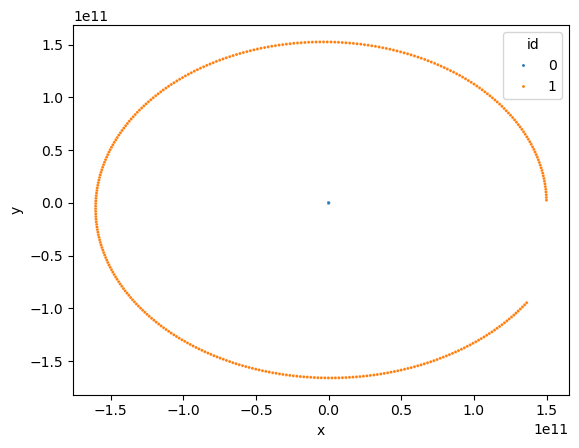

# Example Eval:

The values should be near the calculations for
the Earth going around the Sun once. Some 
values are rounded though.

Here is the `main.c` code I used:

```c

#include <stdio.h>
#include <stdint.h>
#include <stdlib.h>

#include <point.h>
#include <planet.h>

int main() {

    unsigned long steps = 360;
    double step_size = 86400.; // sec // 86 400 seconds in a day 

    Planet Sun = planet_new(1.989e30, 0., 0., 0., 0.);
    Planet Earth = planet_new(5.972e24, 1.5e11, 0., 0., 2.985e4);

    Planet planets[] = {Sun, Earth};
    size_t num_planets = sizeof(planets) / sizeof(Planet);

    FILE *fptr;
    fptr = fopen("simulation.txt", "w");
    if (!fptr) {
        printf("ERROR OPENING FILE\n");
        return 1;
    }

    planet_write_data(fptr, planets, num_planets);
    
    planet_write_stepsize(fptr, step_size);

    fprintf(fptr, "MOTION\ntimestep, id, x, y, Vx, Vy\n");
    
    for (unsigned long t = 0; t < steps; t++) {
        for (size_t i = 0; i < num_planets; i++) {
            const Point accel = planet_acceleration(planets[i], planets, num_planets);
            planet_recalculate(&planets[i], accel, step_size);
        }
        planet_write_motion_data(fptr, planets, num_planets, t);
    }
    
free_resources:
    fclose(fptr);
    return 0;
}
```

# Motion Plot:

Here is the graph I got for the points:



# Plaintext Preview

I'll also include the output in this directory under `simulation.txt`, but here's the first 12 lines as a preview:


```plaintext
BODIES
id, mass, x, y, Vx, Vy, moves
0, 1.989000e+30, 0.000000e+00, 0.000000e+00, 0.000000e+00, 0.000000e+00, 1
1, 5.972000e+24, 1.500000e+11, 0.000000e+00, 0.000000e+00, 2.985000e+04, 1
STEPSIZE: 8.640000e+04 sec
MOTION
timestep, id, x, y, Vx, Vy
0, 0, 6.612116e+01, 0.000000e+00, 1.530583e-03, 0.000000e+00
0, 1, 1.499780e+11, 2.579040e+09, -5.097670e+02, 2.985000e+04
1, 0, 2.644748e+02, 1.136857e+00, 3.060936e-03, 2.631614e-05
1, 1, 1.499119e+11, 5.157701e+09, -1.019458e+03, 2.984124e+04
2, 0, 5.950211e+02, 5.684099e+00, 4.590601e-03, 7.894408e-05
```